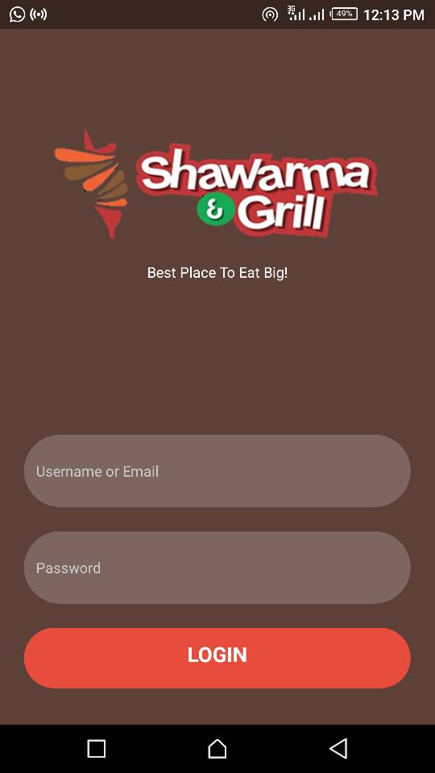

## Shawarma Inventory Management system
This App was built just for management of sales with different products.

## Features

<ul>
    <li>Addition of New Products</li>
    <li>Editing/Updating Products</li>
    <li>Calculation of daily, Weekly & Monthly sales</li>
</ul>

## Technologies Used
<ul>
    <li>React-Native</li>
    <li>Node-JS</li>
    <li>MongoDB</li>
</ul>

## Available Scripts

run `npm start` to get the app Up and running!

Runs your app in development mode.

NOTE: The App is still under build and The Server side code is in the <b>Server Side branch</b>.
 
Make sure to change input your mongodb url in configs directory!